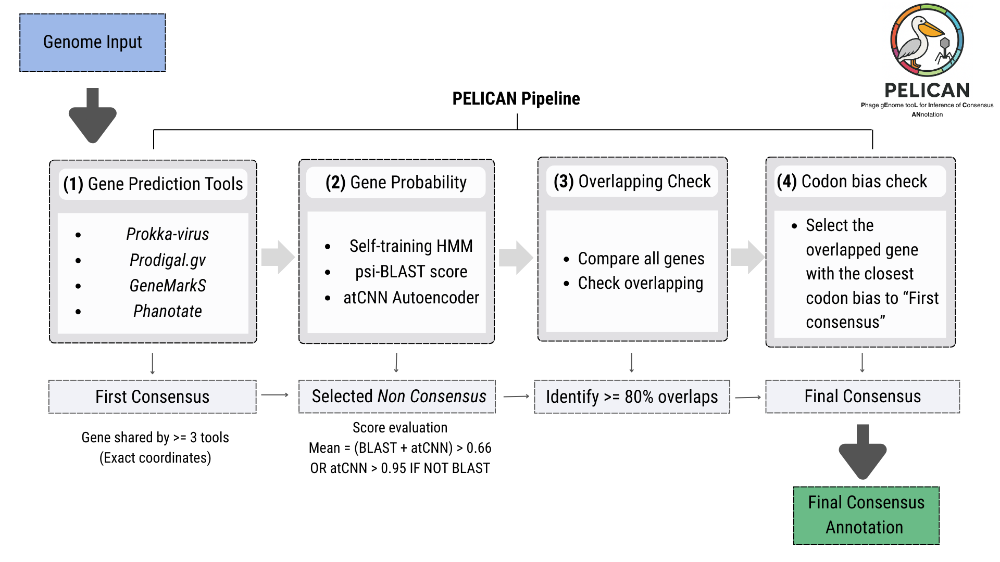

# PELICAN
## Phage gEnome tooL for Inference of Consensus ANnotation

PELICAN is a Machine Learning based tool for automated genome consensus annotation. It runs four gene prediction tools:  
1. Phanotate
2. Prokka-virus
3. prodigalGV
4. GeneMarkS

And from those find the best combination of genes predicted by each tool.  

### Pipeline



1. Gene prediction using all annotation tools.
2. Extracting gene coordinates from the output of each tool.
3. Finding shared genes predicted by at least three of the four tools -- **First consensus**
4. All genes from the **First consensus** are evaluated to calculate the mean codon usage
5. The non-consensus genes are compared to the PHROGS and COGs databases to calculate a BLAST score.
6. The same non-consensus genes are processed by an AutoEncoder (atCNN) to predict if they "look like" phage genes or not.
7. The means score between BLAST and atCNN must exceed 0.66. Otherwise, if only atCNN, the score must exceed 0.95.
8. Finally, all genes are evaluated to check for overlaps higher than 80% of the gene length. If the overlap is significant, both overlapping genes have their codon usage calculated and compared to the **First conensus**. The gene with the closer codon usage is then selected.

### Installation
We recommend the installation via pip is done using conda environments, which will automatically handle dependencies and ensure a smooth setup.

#### 1 - Conda Env
```bash
git clone https://github.com/LaboratorioBioinformatica/PELICAN.git
cd PELICAN
conda env create -n pelican --file PELICAN.yml

#Before running PELICAN for the first time, please run
sudo apt install -y podman golang-github-containers-common uidmap slirp4netns fuse-overlayfs
```
#### Installation

Installation can be done by installing PELICAN from the cloned repository:

```bash
conda activate pelican #Conda env created above
#Make sure to be inside the PELICAN folder
pip install .

#Sometimes the pyrodigal_gv do not install automatically
pip install pyrodigal_gv
```

### Usage

After installation, you can use PELICAN from anywhere:

```bash
pelican -i your_genome.fasta --output_path ./results
```

**Note:** On the first run, PELICAN will automatically decompress the PHROG database files. This is a one-time process that may take a few moments.

### Command-line options

```bash
  -h, --help            show this help message and exit
  -i INPUT, --input INPUT
                        Phage genome in fasta format
  --consensus CONSENSUS
                        Number of tools for initial consensus -- default: 3
  --ident IDENT         minimun identity for blast search (psiblast) -- default: 30
  --cov COV             minimun coverage for blast search (psiblast) -- default: 40
  --output_path OUTPUT_PATH
                        Path fot output folder -- Default: uses current directory
  --version             Show version information
  --create_gff          Create GFF files from predictions
  --create_blastdb      Create BLAST database
  --fill                Force filling of missing genes empty coordinates
  --threads THREADS     Number of threads to use -- default: 4
```

## Simple Example

```bash
pelican -i example_genome.fasta --output_path ./results
```

### Test data and pre-runned outputs

Test data is available on the folder [test_results](pelican/test_data/test_results).  
For the same test genomes, pre-runned results are available for analysis on the folder [test_results](pelican/test_data/test_results).  